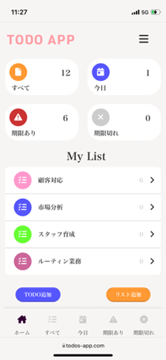
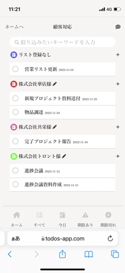
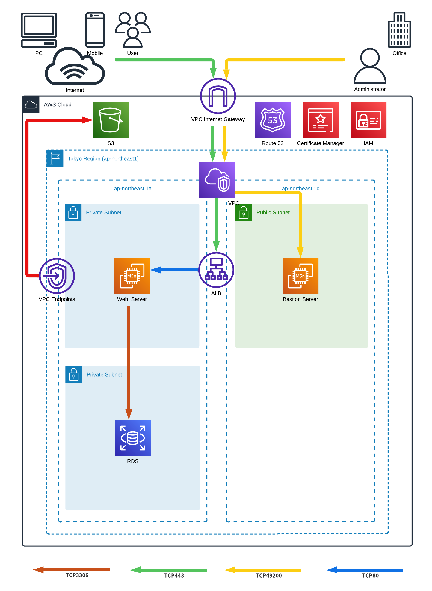
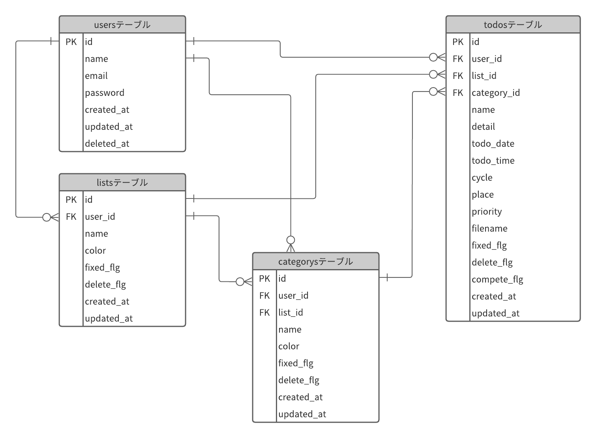

# TODO APP

  

タスク管理アプリTODO APPです。  
ラインのような操作感で、直感的にタスク管理を行うことができます。  
レスポンシブ対応をしており、基本的にはスマートフォンやタブレットで使用することを想定しています。  

アプリの紹介スライドを下記URLに掲載しています。  
READMEよりもわかりやすくまとめているので、ぜひご覧ください。  
[TODOAPP概要説明スライドはこちらから](https://docs.google.com/presentation/d/125RA0qxAItJHc842spg2OiHWJuDqJvwK/edit?usp=sharing&ouid=115836892461911264304&rtpof=true&sd=true)  

  # デモ画面

①SPAでの画面切り替え操作  

  

②TODO追加画面  

  

③TODO一覧画面操作  

  

③TODO検索操作  

  

# URL

https://todos-app.com/  

下記のメールアドレスとパスワードで、ログインすることが可能です。  
メールアドレス：demo@gmail.com  
パスワード：demo0000  

# 使用技術

 - PHP 7.4  
 - Laravel 8.83  
 - MySQL  
 - Node.js 18.0  
 - npm 8.6.0  
 - Vue.js 2.6  
 - Viex 3.2.1  
 - Vue-router 3.5.4
 - jQuery 3.6.0
 - Apache  
 - AWS 
   - VPC
   - EC2
   - Route53
   - RDS
   - ALB
   - ACM
   - IAM
   - S3  
 - Google Maps API
 - axios

# AWS構成図

  

# ER図

  

# 機能一覧

 - TODO追加・編集機能
   - 詳細メモ追加機能
   - リスト・カテゴリーの選択機能
   - 各リスト・各カテゴリーからTODO追加した場合の、リスト・カテゴリーの自動紐づけ機能
   - カレンダーによる日付選択機能
   - TODOの時間選択機能
   - 日付を選択した場合の、TODOの繰り返し設定機能（14種類から選択）
   - 優先順位付け機能
   - 場所選択・地図表示機能（GoogleMapAPI）
   - 画像追加機能（AWS S3）
   - 画像プレビュー機能  
  
  
 - 認証機能
   - ユーザー登録、ログイン機能
   - ログアウト・退会機能
   - アカウント情報編集機能
   - パスワードリマインダー機能
 - リスト・カテゴリーの追加・編集機能
   - 表示アイコンカラー選択機能
   - リスト・カテゴリー削除機能
 - 画面UI
   - ハンバーガーメニュー
   - レスポンシブ対応
   - transition機能
   - フッターメニューでの画面遷移

 
